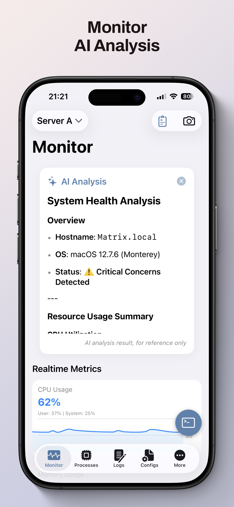
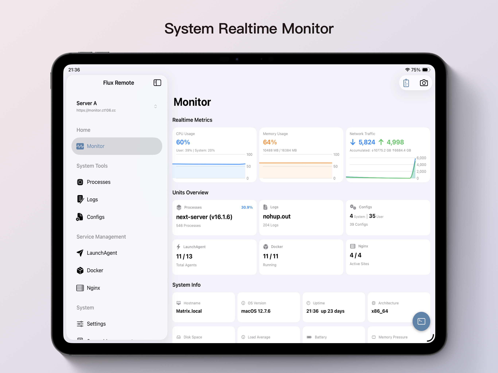

**English | [简体中文](README.zh-CN.md)**

# Flux Remote

This project is the mobile client for [FluxMonitor](https://github.com/chentao1006/FluxMonitor).

## Introduction
Flux Remote is the official mobile application for FluxMonitor, allowing users to remotely monitor and manage services from their mobile devices.

## Features
- Real-time service status monitoring
- Manage and configure services
- Multi-module support (Docker, Nginx, Logs, etc.)
- Multi-language interface (Chinese/English)

## Installation & Usage
1. Clone this repository
2. Open `ios/Flux Remote.xcodeproj` with Xcode
3. Run on your iOS device or simulator

## Related Project
- [FluxMonitor](https://github.com/chentao1006/FluxMonitor)

MIT License

App Store:

## Plan

### iOS
- [x] Project initialization & base architecture
- [x] Login & authentication module
- [x] All module features implementation
- [x] Multi-language interface (EN/CH)
- [x] AI Assistant
- [x] UI/UX improvements
- [ ] Push notification support

### Android
- [ ] Project initialization
- [ ] Login & authentication module
- [ ] All module features implementation
- [ ] Multi-language interface (EN/CH)
- [ ] AI Assistant
- [ ] UI/UX improvements
- [ ] Push notification support
