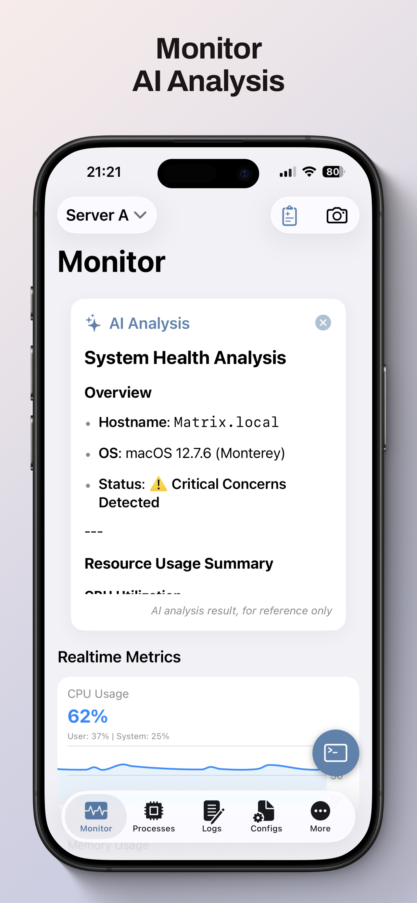
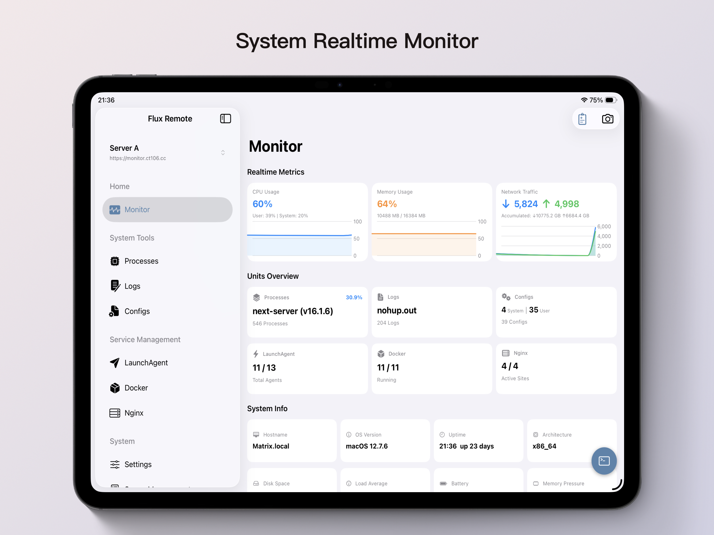

[English](README.md) | **简体中文**

# 浮光远控（Flux Remote）

## 简介
Flux Remote 是为 FluxMonitor 提供的官方移动端应用，方便用户在移动设备上远程监控和管理服务。

## 功能
- 实时监控服务状态
- 管理和配置服务
- 多模块支持（Docker、Nginx、日志、配置、Launch Agent、进程、端口等）
- 多语言界面（中/英）
- 扫码添加服务器（支持在 App 中扫码快速填入服务器配置）

## 相关项目
- [FluxMonitor](https://github.com/chentao1006/FluxMonitor)

## 许可证
MIT License

下载 (Download):

## 开发计划（Plan）

### iOS
- [x] 基础架构与项目初始化
- [x] 登录与认证模块
- [x] 各板块功能实现
- [x] 多语言界面（中/英）
- [x] AI 助手
- [x] UI/UX 优化
- [ ] 推送通知支持

### 安卓（Android）
- [x] Compose 项目初始化
- [x] 服务器列表、登录认证和已保存服务器切换
- [x] 仪表盘与系统监控
- [x] 进程管理
- [x] 端口管理
- [x] 日志与配置文件管理
- [x] Docker、Nginx、Launch Agent 模块
- [x] 多语言界面（中/英）
- [x] AI 配置与已支持模块的 AI 分析
- [x] 发布打包与分发
- [ ] 推送通知支持
